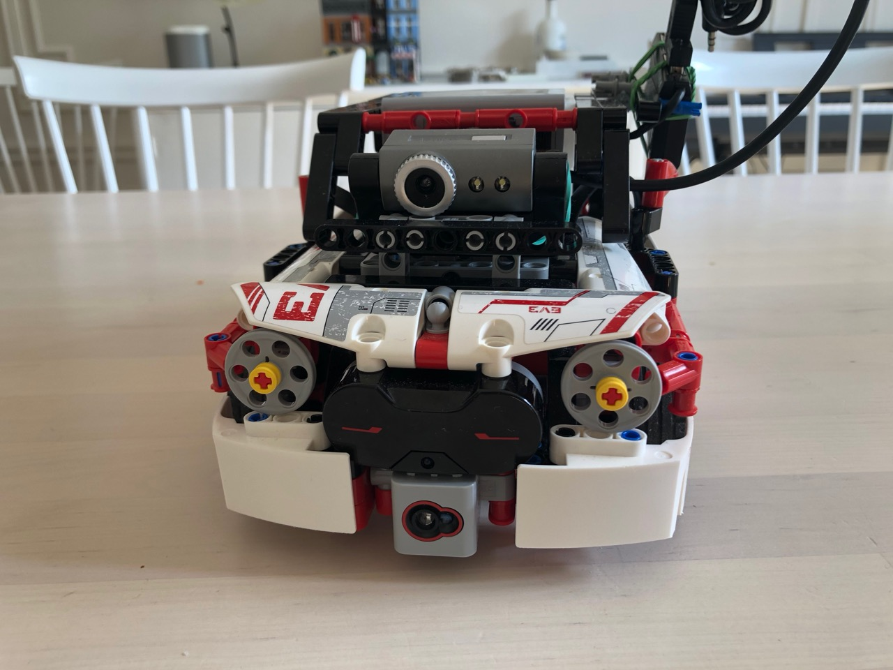

### CLEV3R CAR WEB BASED

This repository contain two ways of driving the car.

* Using PS4 Dualshock controller. I borrowed some code from [How to connect a PS4 Dualshock 4 controller to your MINDSTORMS EV3 brick with Bluetooth](https://www.antonsmindstorms.com/2020/02/14/how-to-connect-a-ps4-dualshock-4-controller-to-your-mindstorms-ev3-brick-with-bluetooth/)
* Web based video streaming solution using some different tools

## Setup and prereq

### Hardware

* Lego Mindstorms Ev3 standard, built model [Clev3r Car](http://buildinst.cz/en/catalog/detail/31)
* Wifi dongle
* USB hub
* Old USB web cam (that is supported in Linux)

### Ev3dev
[https://education.lego.com/en-us/support/mindstorms-ev3/python-for-ev3](https://education.lego.com/en-us/support/mindstorms-ev3/python-for-ev3)
Visual studio Code dev env that works pretty sweet.

### MJPG-STREAMER
Compile and install [mjpg-streamer](https://education.lego.com/en-us/support/mindstorms-ev3/python-for-ev3)
I compiled directly on the ev3dev linux dist.

## Running

If mjpg-streamer is working it should be possible to start using `./start-clev3r-web.sh`.
It should be possible to reach the car using [http://ev3dev.local:8081](http://ev3dev.local:8081).
Please bare in mind that video-stream is running on [http://ev3dev.local:8080/?action=stream](http://ev3dev.local:8080/?action=stream).

There are no security things whatsoever!